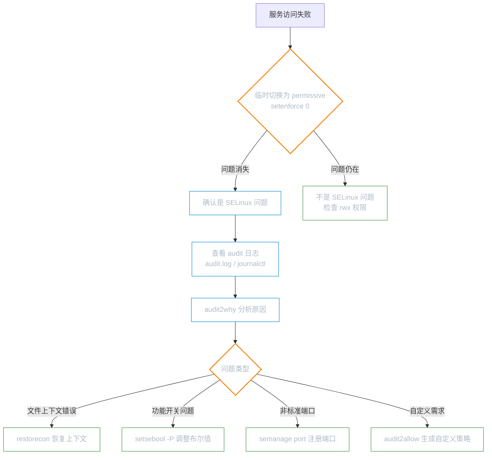

# SELinux 与 AppArmor

**本文你会学到**：

- DAC（自主式访问控制）与 MAC（强制访问控制）的区别
- SELinux 与 AppArmor 的设计哲学
- SELinux 的三个核心组件：Context、Role、Policy
- 文件的 SELinux Context 与进程的 Domain
- 查看与修改 SELinux 上下文（`ls -Z`、`chcon`、`restorecon`）
- SELinux 的工作模式（Enforcing、Permissive、Disabled）
- AppArmor 的配置文件与规则语法
- 常见的 SELinux 错误排查与审计日志
- 针对实际服务的 SELinux 策略调整
- MAC 在企业环境中的应用与注意事项

## DAC vs MAC：两种访问控制模型

### 传统模型的局限：DAC

DAC（Discretionary Access Control，自主式存取控制）是 Linux 的传统权限体系，基于 `rwx` 权限位与文件所有者来决定访问权限。

它有两个致命弱点：

- **root 无限权**：任何以 root 身份运行的程序都拥有最高权限，一旦被入侵，整个系统门户洞开
- **权限可随意下放**：用户可以将目录权限设为 `777`，所有程序均可读写，完全失控

典型风险场景：将 `/var/www/html/` 权限设为 `777` 后，Apache 进程可以写入该目录，而 Apache 又对外提供服务，攻击者可借此写入恶意文件。

### 强制访问控制的解决思路：MAC

MAC（Mandatory Access Control，委任式存取控制）将控制粒度从"用户"细化到"进程"。

核心理念：**每个进程只能访问系统策略明确授权的资源，即使是 root 进程也不例外。**

以 Apache 为例：httpd 进程默认只能访问 `/var/www/` 下的内容，即使 httpd 被攻击者控制，也无法读取 `/etc/shadow` 等敏感文件——因为策略根本没有授权 httpd 访问那些路径。

| 维度 | DAC | MAC |
|------|-----|-----|
| 控制主体 | 文件所有者 / 用户 | 系统策略（管理员制定） |
| root 是否受限 | ❌ 完全豁免 | ✅ 受策略约束 |
| 防内部误用 | 能力有限 | 有效隔离 |
| 典型实现 | Unix `rwx` 权限 | SELinux、AppArmor |

!!! note "两者并存，不是替代"

    MAC 是在 DAC 之上叠加的一层检查，两者同时生效。进程必须**同时通过** MAC 策略检查和 DAC 权限检查，才能访问目标文件。

## SELinux（Red Hat 系默认）

SELinux（Security-Enhanced Linux）由美国国家安全局（NSA）开发并合并进 Linux 内核，是 RHEL/CentOS/Fedora 系列发行版的默认安全模块。

### 三种工作模式

| 模式 | 行为 | 使用场景 |
|------|------|---------|
| `enforcing` | 强制执行策略，拒绝违规访问并记录日志 | 生产环境（推荐） |
| `permissive` | 只记录日志，不实际拦截 | 调试、排查问题 |
| `disabled` | 完全禁用，不参与任何检查 | 不推荐，切换需重启 |

```bash title="查看与切换模式"
# 查看当前模式
getenforce

# 查看详细状态（含策略名称）
sestatus

# 临时切换（无需重启，重启后恢复配置文件设置）
setenforce 1    # 切换到 enforcing
setenforce 0    # 切换到 permissive
```

永久修改需要编辑配置文件并重启：

```bash title="/etc/selinux/config"
# enforcing | permissive | disabled
SELINUX=enforcing

# 策略类型：targeted（默认）| mls | minimum
SELINUXTYPE=targeted
```

!!! warning "禁用 SELinux 需要重启"

    从 `enforcing`/`permissive` 切换到 `disabled`，或从 `disabled` 切换回来，都必须重启系统。从 `disabled` 启用时，系统需要重新为所有文件写入安全上下文标签，首次启动耗时较长，写完后还需再次重启。

### 安全上下文（Security Context）

SELinux 为每个**进程**和**文件**都打上安全标签，称为安全上下文（Security Context）。格式为：

```
user:role:type:level
```

- `user`（身份）：`system_u`（系统进程产生）、`unconfined_u`（用户 bash 产生）
- `role`（角色）：`object_r`（文件/目录）、`system_r`（系统进程）
- **`type`（类型）**：最关键的字段，也叫"域"（domain），决定进程能访问哪些资源
- `level`：MLS 安全级别（`targeted` 策略下通常为 `s0`，可忽略）

在默认的 `targeted` 策略下，**只有 type 字段真正起作用**——进程的 domain 必须与文件的 type 匹配，才能访问该文件。

```bash title="查看 SELinux 上下文"
# 查看文件的上下文（-Z 参数）
ls -Z /var/www/html/

# 查看进程的上下文
ps -eZ | grep httpd

# 查看当前用户的上下文
id -Z
```

输出示例：

```
system_u:object_r:httpd_sys_content_t:s0  /var/www/html/index.html
system_u:system_r:httpd_t:s0             /usr/sbin/httpd
```

`httpd` 进程运行在 `httpd_t` 域，只有 `httpd_sys_content_t` 类型的文件才能被它读取——这就是 MAC 的核心机制。

### 修复文件上下文

⚠️ 最常见的 SELinux 问题就是**文件上下文类型不正确**，导致服务无法读取自己的文件（即使 `rwx` 权限是开放的）。

典型场景：将文件从 home 目录 `mv` 到 `/etc/cron.d/`，文件保留了原来的 `admin_home_t` 上下文，crond 进程读不到它，服务静默失败。

```bash title="修复文件上下文"
# 恢复默认上下文（最常用的修复方法）
restorecon -Rv /var/www/html/

# 临时修改（重新标记或 restorecon 后会丢失）
chcon -t httpd_sys_content_t /path/to/file

# 永久修改：先添加规则，再应用
semanage fcontext -a -t httpd_sys_content_t "/mydata(/.*)?"
restorecon -Rv /mydata/

# 查看某路径的默认上下文规则
semanage fcontext -l | grep /var/www
```

### 布尔值（Boolean）：细粒度开关

SELinux 的策略里内置了很多可以动态开关的规则，称为布尔值（Boolean）。不需要修改策略文件，通过布尔值就能控制是否允许某类行为。

```bash title="布尔值管理"
# 查看所有布尔值
getsebool -a
semanage boolean -l

# 查看单个布尔值状态
getsebool httpd_can_network_connect

# 临时开启（重启后恢复）
setsebool httpd_can_network_connect on

# 永久开启（-P 表示 persistent）
setsebool -P httpd_can_network_connect on
```

常用布尔值速查：

| 布尔值 | 作用 |
|--------|------|
| `httpd_can_network_connect` | 允许 Apache 发起网络连接（反向代理等） |
| `httpd_enable_homedirs` | 允许 Apache 访问用户主目录 |
| `samba_enable_home_dirs` | 允许 Samba 共享用户主目录 |
| `allow_ftpd_anon_write` | 允许 FTP 匿名写入 |
| `httpd_use_nfs` | 允许 Apache 访问 NFS 挂载目录 |

### 端口管理

服务监听非标准端口时，SELinux 也会拦截。需要显式注册允许的端口：

```bash title="SELinux 端口管理"
# 查看 HTTP 相关允许端口
semanage port -l | grep http

# 允许 httpd 监听 8080 端口
semanage port -a -t http_port_t -p tcp 8080

# 删除端口规则
semanage port -d -t http_port_t -p tcp 8080
```

### 排查拒绝问题

遇到疑似 SELinux 导致的权限问题时，按以下流程排查：



```bash title="审计日志与分析工具"
# 实时查看拒绝日志
tail -f /var/log/audit/audit.log | grep AVC

# 查看最近的拒绝记录
ausearch -m AVC -ts recent

# audit2why：用人话解释为什么被拒绝
ausearch -m AVC -ts recent | audit2why

# audit2allow：根据日志生成允许规则（谨慎使用）
ausearch -m AVC -ts recent | audit2allow -m mypolicy
```

!!! tip "优先用 restorecon 和 setsebool，谨慎用 audit2allow"

    `audit2allow` 生成的自定义策略会绕过 SELinux 的保护意图，应优先通过 `restorecon`（修复上下文）或 `setsebool`（开启功能开关）解决问题，实在无法解决再考虑自定义策略。

## AppArmor（Debian 系默认）

AppArmor 是 Debian/Ubuntu/SUSE 系列的默认 MAC 实现，相比 SELinux 采用更直观的**路径规则**（Profile）方式，学习曲线较平缓。

### 两种工作模式

| 模式 | 行为 |
|------|------|
| `enforce` | 强制执行，拦截违规访问 |
| `complain` | 仅记录日志，不拦截（类似 SELinux 的 permissive） |

### 常用操作

```bash title="查看 AppArmor 状态"
# 查看整体状态（各 profile 的模式统计）
aa-status

# 查看特定应用
aa-status | grep nginx
```

```bash title="切换模式"
# 切换到强制模式
aa-enforce /etc/apparmor.d/usr.sbin.nginx

# 切换到投诉模式（仅记录）
aa-complain /etc/apparmor.d/usr.sbin.nginx

# 禁用某个 profile
aa-disable /etc/apparmor.d/usr.sbin.nginx

# 重新加载 profile（修改后生效）
apparmor_parser -r /etc/apparmor.d/usr.sbin.nginx
systemctl reload apparmor
```

### Profile 结构

AppArmor 的配置文件（Profile）存放在 `/etc/apparmor.d/`，以程序路径命名，内容直观：

```
/usr/sbin/nginx {
  # 允许绑定低端口的能力
  capability net_bind_service,

  # 日志目录：可读写
  /var/log/nginx/** rw,

  # 网站根目录：只读
  /var/www/html/** r,

  # 配置目录：只读
  /etc/nginx/** r,

  # PID 文件：可读写
  /run/nginx.pid rw,
}
```

权限字符说明：`r`（读）、`w`（写）、`x`（执行）、`k`（文件锁）、`m`（内存映射）。

### 查看拒绝日志与生成 Profile

```bash title="拒绝日志"
# 在 syslog 中查找
grep "apparmor" /var/log/syslog | grep DENIED

# 在 journald 中查找
journalctl | grep "apparmor.*DENIED"
```

```bash title="生成与更新 Profile"
# 交互式生成新 profile（会引导你运行程序并批准访问）
aa-genprof /usr/bin/myapp

# 根据 complain 模式积累的日志更新现有 profile
aa-logprof
```

## SELinux vs AppArmor 对比

| 特性 | SELinux | AppArmor |
|------|---------|---------|
| 默认发行版 | RHEL / Fedora / CentOS | Debian / Ubuntu / SUSE |
| 控制粒度 | 极细（用户/角色/类型/级别） | 中等（路径/能力） |
| 学习曲线 | 较陡，概念较多 | 较平，规则直观 |
| 配置方式 | 类型强制（Type Enforcement） | 路径规则（Profile） |
| 调试工具 | `audit2why` / `audit2allow` | `aa-logprof` |
| 内核实现 | 基于标签（inode 存储上下文） | 基于路径（文件名匹配） |

## 发行版安装与配置

=== "Red Hat / RHEL / CentOS"

    SELinux 默认已启用（`enforcing` 模式），安装调试工具：

    ```bash
    # 安装策略管理工具和排错辅助工具
    dnf install policycoreutils-python-utils setroubleshoot

    # setroubleshootd 服务：在 /var/log/messages 输出易读的排错建议
    systemctl enable --now setroubleshootd
    ```

    查看 `setroubleshootd` 的建议：

    ```bash
    sealert -a /var/log/audit/audit.log
    ```

=== "Debian / Ubuntu"

    AppArmor 默认已启用，安装完整工具集：

    ```bash
    apt install apparmor apparmor-utils apparmor-profiles
    ```

    如需安装 SELinux（不推荐，与 AppArmor 冲突）：

    ```bash
    # 安装后需重启，AppArmor 会被自动禁用
    apt install selinux-basics selinux-policy-default
    selinux-activate
    ```

