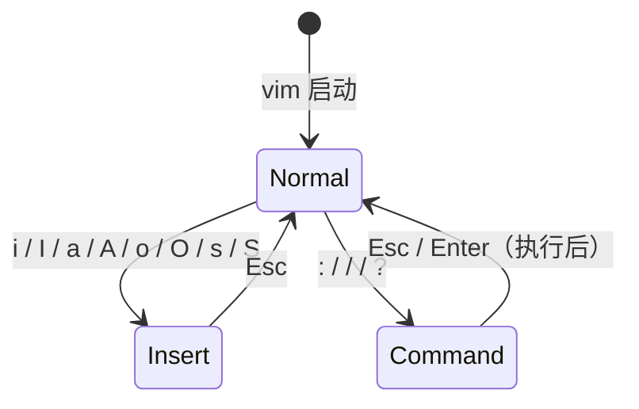

# Vim 编辑器

**本文你会学到**：

- Vim 三种模式及其切换方式（普通模式、插入模式、命令行模式）
- 光标移动的高效快捷键（hjkl、word-based、line-based）
- 删除、复制、粘贴、撤销、重做的操作符与数字组合
- 搜索与替换的正则表达式用法
- 多行缩进、注释与代码块操作
- 标记（mark）、跳转、buffer 与 window 管理
- Vim 配置文件 `.vimrc` 的基础设置
- 在 Vim 中运行 shell 命令和外部程序
- 常见编辑器对比与 Vim 的学习路线

## 三种模式：vim 的核心设计

刚接触 vim 的人最大的困惑是：为什么按键盘没有反应，或者按出了奇怪的东西？原因在于 vim 有**三种模式**，不同模式下同一个按键的含义完全不同。



**普通模式（Normal mode）**：启动 vim 后默认进入，所有按键都是命令（移动光标、删除、复制等），**不会**直接输入字符。

**插入模式（Insert mode）**：进入后才能输入文字，左下角显示 `-- INSERT --` 或 `-- REPLACE --`。

**命令行模式（Command-line mode）**：输入 `:` 进入，在底部命令行执行保存、退出、替换等操作。

!!! warning "编辑模式与命令行模式不能互换"

    只有普通模式可以切换到编辑模式和命令行模式，**编辑模式与命令行模式之间不能直接切换**，必须先按 `Esc` 回到普通模式。

## 进入与退出

### 打开文件

``` bash
vim file              # 打开文件（不存在则新建）
vim +10 file          # 打开并跳转到第 10 行
vim +/pattern file    # 打开并自动搜索 pattern
vim -R file           # 只读模式打开（防止误改）
vim file1 file2       # 同时打开多个文件
```

### 保存与退出

在**命令行模式**（按 `:` 进入）中执行：

| 命令 | 含义 |
|------|------|
| `:w` | 保存（不退出） |
| `:w filename` | 另存为新文件 |
| `:q` | 退出（文件未修改时） |
| `:q!` | 强制退出，放弃所有修改 |
| `:wq` | 保存后退出 |
| `:wq!` | 强制保存后退出（只读文件，需有权限） |
| `:x` | 有修改才写入，再退出（与 `:wq` 类似） |

在**普通模式**中还有两个快捷键：

- `ZZ`：若文件有修改则保存后退出，无修改则直接退出
- `ZQ`：不保存强制退出（等同 `:q!`）

!!! tip "初学者备忘：三步走"

    1. `i` — 进入插入模式开始编辑
    2. `Esc` — 回到普通模式
    3. `:wq` — 保存退出

## 普通模式：光标移动

### 基础方向移动

| 按键 | 移动方向 | 说明 |
|------|---------|------|
| `h` | ← 左 | 也可用方向键，但方向键效率低 |
| `j` | ↓ 下 | |
| `k` | ↑ 上 | |
| `l` | → 右 | |
| `{n}h/j/k/l` | 移动 n 步 | 如 `20j` 向下移动 20 行 |

### 词级移动

| 按键 | 说明 |
|------|------|
| `w` / `W` | 跳到下一个词首（`W` 以空白分隔词） |
| `b` / `B` | 跳到上一个词首 |
| `e` / `E` | 跳到当前词尾 |

### 行内移动

| 按键 | 说明 |
|------|------|
| `0` 或 `Home` | 跳到行首（含空白） |
| `^` | 跳到行首第一个非空白字符 |
| `$` 或 `End` | 跳到行尾 |
| `f{c}` | 跳到本行下一个字符 `c` 处 |

### 跨行与文件移动

| 按键 | 说明 |
|------|------|
| `gg` | 跳到文件第一行（等同 `1G`） |
| `G` | 跳到文件最后一行 |
| `{n}G` | 跳到第 n 行，如 `30G` |
| `:{n}` | 命令行模式跳转行号，如 `:30` |
| `Ctrl-f` | 向下翻一页（Page Down） |
| `Ctrl-b` | 向上翻一页（Page Up） |
| `Ctrl-d` | 向下翻半页 |
| `Ctrl-u` | 向上翻半页 |
| `{n}%` | 按文件百分比跳转，如 `50%` 跳到中间 |

### 屏幕相对定位

| 按键 | 说明 |
|------|------|
| `H` | 光标移到屏幕顶部第一行 |
| `M` | 光标移到屏幕中间行 |
| `L` | 光标移到屏幕底部最后行 |
| `zz` | 当前行滚动到屏幕中央 |
| `zt` | 当前行滚动到屏幕顶部 |
| `zb` | 当前行滚动到屏幕底部 |

## 普通模式：编辑操作

### 删除

| 按键 | 说明 |
|------|------|
| `x` | 删除光标处字符（相当于 Delete） |
| `X` | 删除光标前一个字符（相当于 Backspace） |
| `dd` | 删除当前整行 |
| `{n}dd` | 删除从当前行起共 n 行，如 `5dd` |
| `dw` | 删除当前词 |
| `d$` 或 `D` | 删除从光标到行尾 |
| `d0` | 删除从行首到光标前 |
| `d1G` | 删除从文件头到当前行 |
| `dG` | 删除从当前行到文件尾 |

### 复制与粘贴

| 按键 | 说明 |
|------|------|
| `yy` | 复制当前行 |
| `{n}yy` | 复制从当前行起共 n 行，如 `5yy` |
| `yw` | 复制当前词 |
| `y$` | 复制从光标到行尾 |
| `y0` | 复制从行首到光标 |
| `y1G` | 复制从文件头到当前行 |
| `yG` | 复制从当前行到文件尾 |
| `p` | 在光标**下方**（或后方）粘贴 |
| `P` | 在光标**上方**（或前方）粘贴 |

### 修改与替换

| 按键 | 说明 |
|------|------|
| `r{c}` | 替换光标处的单个字符为 `c` |
| `R` | 进入替换模式（覆盖输入），按 `Esc` 退出 |
| `cw` | 删除当前词并进入插入模式 |
| `cc` 或 `S` | 删除整行并进入插入模式 |
| `C` | 删除从光标到行尾并进入插入模式 |
| `J` | 将下一行合并到当前行末尾 |

### 撤销与重做

| 按键 | 说明 |
|------|------|
| `u` | 撤销上一次操作 |
| `Ctrl-r` | 重做（撤销的撤销） |
| `.` | **重复上一次操作**（极常用！） |

!!! tip "`.` 是效率神器"

    比如先用 `dw` 删一个词，然后移到下一个词按 `.` 继续删——任何重复性操作都可以用 `.` 完成，大幅提升效率。

## 进入插入模式的方式

从普通模式进入插入模式的按键不止 `i`，每种进入方式光标落点不同：

| 按键 | 进入位置 |
|------|---------|
| `i` | 光标当前位置之前 |
| `I` | 当前行第一个非空白字符处 |
| `a` | 光标当前位置之后 |
| `A` | 当前行行尾 |
| `o` | 在当前行**下方**新开一行 |
| `O` | 在当前行**上方**新开一行 |
| `s` | 删除光标处字符后进入插入模式 |
| `S` | 删除整行内容后进入插入模式 |

## 可视模式：选区操作

可视模式让你先选中一块区域，再对整块执行操作：

| 按键 | 选区类型 |
|------|---------|
| `v` | 字符可视模式（按字符选择） |
| `V` | 行可视模式（整行选择） |
| `Ctrl-v` | 块可视模式（矩形区域选择） |

选中区域后，可以执行：

- `d` — 删除选中区域
- `y` — 复制选中区域
- `>` / `<` — 增加/减少缩进
- `I`（配合块选 `Ctrl-v`）— 在每行同一位置插入文字

!!! tip "块可视模式的典型用途"

    想给多行代码同时添加注释符 `#`？先按 `Ctrl-v` 进入块选，向下移动选中多行，再按 `I` 输入 `#`，最后按 `Esc`——所有选中行的对应位置都会插入 `#`。

## 搜索

### 基本搜索

| 按键 | 说明 |
|------|------|
| `/pattern` | 向下搜索 pattern |
| `?pattern` | 向上搜索 pattern |
| `n` | 重复上一次搜索方向继续查找 |
| `N` | 反方向继续查找 |
| `*` | 搜索光标所在的当前单词（向下） |
| `#` | 搜索光标所在的当前单词（向上） |

### 搜索与替换

在命令行模式中执行替换命令：

``` bash
:s/old/new/           # 替换当前行第一个匹配
:s/old/new/g          # 替换当前行所有匹配
:%s/old/new/g         # 全文替换所有匹配
:10,20s/old/new/g     # 只在第 10-20 行替换
:1,$s/old/new/gc      # 全文替换，每次需确认（c = confirm）
:'<,'>s/old/new/g     # 对可视模式选中区域替换
:g/pattern/d          # 删除所有包含 pattern 的行
```

!!! tip "取消搜索高亮"

    搜索后匹配词会持续高亮，执行 `:noh`（no highlight）可以临时关闭，下次搜索时自动重新开启。

## 命令行模式：文件与窗口操作

### 文件操作

| 命令 | 说明 |
|------|------|
| `:w` | 保存当前文件 |
| `:w filename` | 另存为新文件（不切换编辑文件） |
| `:r filename` | 将 filename 内容读入并插入到光标后 |
| `:e filename` | 打开新文件编辑 |
| `:! command` | 不退出 vim，临时执行 Shell 命令，如 `:! ls /home` |
| `:e!` | 放弃所有修改，重新从磁盘载入文件 |

### 多窗口（分屏）

``` bash
:sp [filename]    # 水平分割窗口（不加文件名则同步显示同一文件）
:vsp [filename]   # 垂直分割窗口
```

分屏后在窗口间跳转：

| 按键 | 说明 |
|------|------|
| `Ctrl-w h/j/k/l` | 移动到左/下/上/右窗口 |
| `Ctrl-w w` | 循环切换到下一个窗口 |
| `Ctrl-w q` | 关闭当前窗口 |

### 多文件（Buffer）编辑

``` bash
vim file1 file2   # 同时打开多个文件
:files            # 列出当前 vim 中打开的所有文件
:n                # 切换到下一个文件
:N                # 切换到上一个文件
:ls               # 列出 buffer 列表
:bn               # 切换到下一个 buffer
:bp               # 切换到上一个 buffer
```

### 常用设置命令

| 命令 | 说明 |
|------|------|
| `:set nu` / `:set nonu` | 显示/取消行号 |
| `:set hlsearch` / `:set nohlsearch` | 开启/关闭搜索高亮 |
| `:set autoindent` | 自动缩进 |
| `:set paste` | 粘贴模式（粘贴外部内容时关闭自动缩进） |
| `:syntax on` / `:syntax off` | 开启/关闭语法高亮 |
| `:set all` | 显示所有配置项当前值 |

## 智能补全（vim 内置）

vim 在插入模式下提供关键字补全，按下 `Ctrl-x` 后再按对应键触发：

| 组合键 | 补全来源 |
|--------|---------|
| `Ctrl-x → Ctrl-n` | 当前文件中出现过的词 |
| `Ctrl-x → Ctrl-f` | 当前目录下的文件名 |
| `Ctrl-x → Ctrl-o` | 按文件扩展名匹配 vim 内置语法关键字（需正确扩展名） |

## 暂存文件与崩溃恢复

vim 编辑文件时会在同目录自动创建 `.filename.swp` 暂存文件，实时记录编辑操作。若 vim 异常中断（断电、进程被杀），下次打开同一文件时会看到警告，提供以下选项：

| 选项 | 说明 |
|------|------|
| `O`（Open Read-Only） | 只读打开，不恢复未保存内容 |
| `E`（Edit anyway） | 忽略暂存文件直接编辑（有覆盖风险） |
| `R`（Recover） | 载入暂存文件内容，恢复上次未保存的修改 |
| `D`（Delete it） | 删除暂存文件，以磁盘原文件重新开始 |
| `Q`（Quit） | 退出 vim |

!!! warning "恢复后需手动删除暂存文件"

    使用 `R` 恢复并保存退出后，`.swp` 文件**不会自动删除**，需手动 `rm .filename.swp`，否则下次打开仍会触发警告。

## 标记（Marks）

标记允许你在文件中"打书签"，快速跳回之前的位置。这在处理大文件或多处修改时特别有用。

### 小写字母标记（文件内有效）

``` bash
ma              # 在当前行设置标记 a
'a              # 跳到标记 a 所在的行首
`a              # 跳到标记 a 的精确位置（字符级）
```

`a-z` 共 26 个标记，互相独立，仅在该文件内有效。关闭文件后标记消失。

### 大写字母标记（全局，跨文件）

``` bash
mA              # 设置全局标记 A
'A              # 跳到标记 A 的位置，即使在另一个文件中
# 打开 fileB.txt 后：
'A              # 能跳回到 fileA.txt 中的标记 A 位置
```

大写字母标记跨越文件边界，即使关闭后仍存在于 vim 会话期间。

### 内置标记

Vim 自动维护几个特殊标记：

| 标记 | 含义 |
|------|------|
| `` `. `` | 上次修改的位置 |
| `` `` ` `` | 上次跳转前的位置（'' 是行首，`` `` 是精确） |
| `'^` | 上次插入模式离开的位置 |
| `'>` 和 `'<` | 最后选中区域的末尾和开头（Visual 模式） |

### 查看和删除标记

``` bash
:marks          # 列出所有标记（包括内置）
:marks a        # 只查看标记 a
:delmarks a     # 删除标记 a
:delmarks!      # 删除所有小写标记
```

## 寄存器（Registers）

Vim 不仅有一个剪贴板，而是有 30+ 个"寄存器"。学会使用寄存器能处理复杂的编辑任务。

### 无名寄存器 `""`

所有 `d`（删除）、`y`（复制）、`c`（修改）操作默认存入无名寄存器。

``` bash
yy              # 复制当前行到无名寄存器
p               # 从无名寄存器粘贴（等同 ""p）
```

### 命名寄存器 `"a` ~ `"z`

显式指定寄存器进行复制、粘贴、删除。

``` bash
"ayy            # 复制当前行到寄存器 a
"ap             # 从寄存器 a 粘贴

"Ad             # 把光标处词**追加**到寄存器 a（大写是追加，小写是覆盖）
```

典型场景：收集多处文本到一个寄存器，然后一次性粘贴。

### 数字寄存器 `"0` ~ `"9`

- `"0`：最近的 yank（复制），未被 delete 覆盖
- `"1` ~ `"9`：最近删除的内容（历史，"1 最新）

``` bash
yy              # 复制，存到 "0
dd              # 删除，"1 存当前内容，"0 保持不变
p               # 粘贴 "1（最近删除）
"0p             # 粘贴 "0（之前复制的）
```

### 系统剪贴板 `"+` 和 `"*`

与桌面系统共享剪贴板。需要 vim 编译时开启 `+clipboard` 特性。

``` bash
"+y             # 复制到系统剪贴板
"+p             # 从系统剪贴板粘贴

# 在普通 vim 中如果无效，需要编译支持：
vim --version | grep clipboard    # 看前面有没有 +clipboard
```

### 只读寄存器

这些寄存器无法被修改，仅用于读取：

| 寄存器 | 内容 |
|--------|------|
| `"%` | 当前文件名 |
| `".` | 上次插入的文本 |
| `":` | 上次执行的 ex 命令 |
| `"/` | 上次搜索的模式 |

``` bash
# 将文件名插入当前行
"=%p            # 在新行粘贴文件名

# 重复上次插入的文本
">.             # 这个用法不常见，通常用 `.` 命令重复修改
```

### 查看寄存器内容

``` bash
:registers              # 或 :reg，列出所有寄存器
:registers a b c        # 只查看指定寄存器
```

## 宏（Macros）

宏是"录制并重放按键序列"的机制，能把重复操作自动化。对于需要对每行执行相同编辑的任务特别有用。

### 录制宏

``` bash
q{a-z}          # 开始录制到寄存器 {a-z}
...             # 执行一系列编辑操作
q               # 停止录制
```

录制期间，vim 会记录每个按键和命令。

### 执行宏

``` bash
@{a-z}          # 执行一次寄存器中的宏
@@              # 重复执行上一个宏
5@a             # 执行宏 a 五次
```

### 实战示例：给每行末尾加分号

``` bash
# 假设有 100 行代码，都缺少末尾的分号
# 光标在第一行行首

qa              # 开始录制宏 a
A;              # 插入模式，行末添加分号
<Esc>           # 退出插入模式
j               # 移到下一行
q               # 停止录制

# 然后执行宏 99 次（处理剩下 99 行）
99@a
```

执行过程：
1. `qa` 后，Vim 记录 `A;` `<Esc>` `j`
2. `99@a` 执行 99 次：每次添加分号，然后下移一行

### 宏编辑技巧

宏本质就是寄存器中的按键序列，可以被读取和修改：

``` bash
:registers a            # 查看宏 a 的内容

# 粘贴宏 a 到编辑区，编辑后再写回
"ap                     # 将宏 a 粘贴
# （修改内容）
"ay$                    # 复制当前行回到寄存器 a
```

!!! warning "宏中的光标移动很关键"

    录制宏时，**每个移动操作都被记录**。若希望宏能在不同位置可靠执行，应该从固定位置开始（如 `H` 跳到行首，或 `G` 跳到末尾）。否则宏在不同上下文中可能出错。

## 高效移动补充

### 屏幕相对定位（上次提到过，强调再用）

| 命令 | 功能 |
|------|------|
| `H` | 跳到屏幕顶部（High）行的首个非空字符 |
| `M` | 跳到屏幕中间（Middle） |
| `L` | 跳到屏幕底部（Low） |
| `zz` | 将当前行滚动到屏幕中央 |
| `zt` | 将当前行滚动到屏幕顶部 |
| `zb` | 将当前行滚动到屏幕底部 |

### 段落与句子跳转

``` bash
{               # 跳到前一个空行（段落开头）
}               # 跳到后一个空行（段落末尾）

(               # 跳到前一句句首（以 . ! ? 结尾）
)               # 跳到后一句句首
```

### 匹配括号跳转

``` bash
%               # 在匹配的括号 () [] {} 间跳转
# 光标在 ( 上，% 跳到对应 )，再按 % 又跳回
```

### 单词搜索与快速定位

``` bash
*               # 搜索光标处单词（全词匹配），向后跳到下一个
#               # 向前搜索光标处单词

# 实战：快速重命名变量
# 光标在 oldName，按 * 找到所有出现，
# 然后用 cgn oldNewName<Esc> 修改第一个，
# n. 跳到下一个并重复修改
```

### 本行快速定位 f / t

这两个单字符命令在当前行内快速跳转，配合 `;` 和 `,` 很高效：

``` bash
f{char}         # 在当前行向右搜索字符 {char}，光标停在该字符上
F{char}         # 向左搜索
t{char}         # 在当前行向右搜索字符 {char}，光标停在**字符前一位**（to）
T{char}         # 向左搜索，停在字符后一位

;               # 重复上一次 f/F/t/T 搜索（同方向）
,               # 反向重复上一次搜索
```

实战示例：修改函数参数

``` bash
# 原文：func(arg1, arg2, arg3)
# 光标在行首 f，想快速修改 arg2

f,              # 跳到第一个逗号
t)              # 跳到 ) 前一位（即 arg2 末尾处）
B               # 退回单词开头
cw newarg<Esc>  # 修改单词
```

## 点命令与重复编辑

`.`（点命令）是 Vim 里**最强大的单字符命令**之一——它重复上一次修改操作。掌握点命令能让重复编辑变得简洁高效。

### 什么是"修改"

修改 (change) 指任何改变文本内容的操作：

- `d`（删除）
- `y`（复制，虽然通常不算修改）
- `c`（修改）
- 插入模式中的任何输入
- `>` / `<`（缩进）
- `=`（格式化）

但**不包括**移动（如 `j`、`w` 等）。

### 实战：最小化修改单元

策略是把修改细分成最小的原子操作，然后用 `n.` 组合快速应用到多处：

#### 示例 1：替换多个单词

``` bash
# 原文：
# foo bar baz
# foo bar baz
# foo bar baz

# 需求：把所有 foo 改为 XXX

# 方法：
* cw XXX<Esc>   # 搜索 foo，修改为 XXX
n.              # 跳到下一个 foo，重复修改
n.
n.
```

#### 示例 2：在多行末尾加内容

``` bash
# 原文：三行都缺分号
statement1
statement2
statement3

# 光标在第 1 行：
$A;<Esc>        # 行末插入分号
j.              # 下一行，重复
j.
```

#### 示例 3：删除多行前缀

``` bash
# 原文（注释行）：
# comment 1
# comment 2
# comment 3

# 需求：删除所有行首的 #

# 光标在第 1 行行首：
f# x             # 找到 # 并删除
j.              # 下一行，重复
j.
```

!!! tip "对比 sed 的优势"

    这里的方法比 `:s/foo/XXX/g` 更直观，因为你看得到每一处修改，可以随时取消或调整。对于需要核查的修改特别有用。

## vim 配置文件（~/.vimrc）


每次启动 vim 都要手动 `:set ...` 很麻烦，把配置写入 `~/.vimrc` 即可永久生效：

``` vim title="~/.vimrc"
" 双引号开头的行是注释
set number          " 显示行号
set relativenumber  " 显示相对行号（跳转时特别有用）
set tabstop=4       " Tab 键宽度为 4 个空格
set shiftwidth=4    " 自动缩进宽度
set expandtab       " 将 Tab 转换为空格
set autoindent      " 自动缩进（Enter 后与上一行对齐）
set hlsearch        " 高亮显示搜索结果
set incsearch       " 增量搜索（边输入边高亮）
set ignorecase      " 搜索时忽略大小写
set smartcase       " 搜索词含大写时自动区分大小写
set cursorline      " 高亮当前行
set ruler           " 状态栏显示光标位置（行:列）
set showmode        " 左下角显示当前模式
set backspace=2     " 插入模式下 Backspace 可删除任意字符
syntax on           " 开启语法高亮
set encoding=utf-8  " 文件编码
set bg=dark         " 深色背景配色（深蓝注释更易读）
```

!!! note "系统级配置与用户级配置"

    系统级配置在 `/etc/vimrc`，不建议直接修改。用户级配置在 `~/.vimrc`（默认不存在，自行创建），**优先级更高**，且只影响当前用户。

## Neovim 简介

Neovim 是 vim 的现代分支，保持完整命令兼容的同时带来了改进：

- 原生异步插件架构（不卡顿）
- 内置 LSP 客户端（语言服务器，提供代码补全、跳转定义）
- 使用 Lua 作为配置语言（比 Vimscript 更强大）
- 活跃的社区生态（lazy.nvim、Telescope 等插件）

配置文件路径为 `~/.config/nvim/init.lua`（Lua 配置）或 `~/.config/nvim/init.vim`（兼容 Vimscript）。

所有 vim 命令和按键在 Neovim 中完全适用。

## 安装

=== "Debian / Ubuntu"

    ``` bash
    # 安装 vim
    sudo apt install vim

    # 安装 neovim
    sudo apt install neovim
    ```

=== "Red Hat / RHEL / CentOS / Fedora"

    ``` bash
    # 安装 vim（完整版含语法高亮等）
    sudo dnf install vim-enhanced

    # 安装 neovim
    sudo dnf install neovim
    ```

验证安装：

``` bash
vim --version | head -1    # 查看 vim 版本
nvim --version             # 查看 neovim 版本
```
