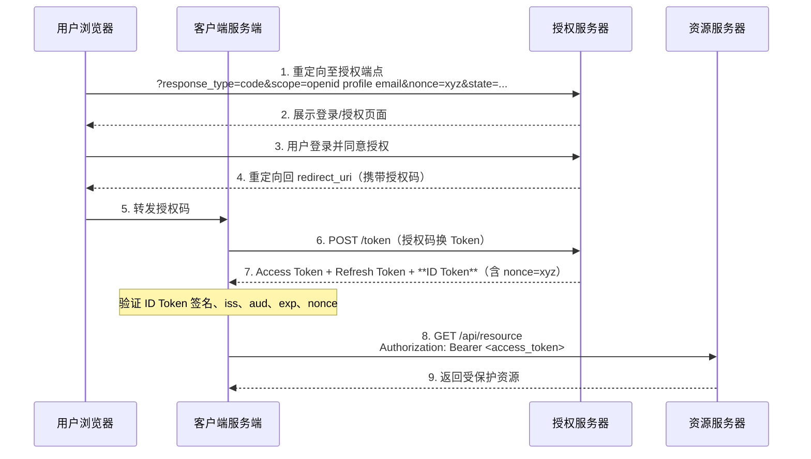

# OpenID Connect

OpenID Connect（OIDC）是构建在 OAuth2 之上的**身份认证层**。如果说 OAuth2 解决了"应用能做什么"，那么 OIDC 解决的是"用户是谁"。

## OIDC 与 OAuth2 的关系

!!! info "关键区别"

    | 协议 | 解决的问题 | 核心令牌 |
    |------|----------|---------|
    | OAuth2 | **授权**：该应用有权限访问哪些资源？ | Access Token |
    | OpenID Connect | **认证**：当前登录的用户是谁？ | ID Token |

    OIDC 并不替代 OAuth2，而是在 OAuth2 授权码流程的基础上，额外颁发一个 **ID Token** 来携带用户身份信息。使用 OIDC 时，OAuth2 的所有机制都保持不变。

**OIDC 的三种流程：**

- **Authorization Code Flow**（最常用，推荐）
- Implicit Flow（已废弃）
- Hybrid Flow（部分场景使用）

## ID Token

ID Token 是 OIDC 的核心，是一个 **JWT 格式**的令牌（JWT 结构详见 [JWT 令牌](../jwt/index.md)），包含已认证用户的身份信息。

### 标准 Claim（声明）

| Claim | 含义 | 是否必须 |
|-------|------|---------|
| `sub` | 用户唯一标识符（Subject），在授权服务器范围内唯一 | ✅ 必须 |
| `iss` | ID Token 颁发者的 URL（Issuer） | ✅ 必须 |
| `aud` | 接收方，通常是客户端的 Client ID（可以是字符串或数组，多受众时为数组） | ✅ 必须 |
| `exp` | 过期时间（Unix 时间戳） | ✅ 必须 |
| `iat` | 颁发时间（Unix 时间戳） | ✅ 必须 |
| `nonce` | 客户端请求时传入的随机值，防重放攻击 | 若请求中有则必须 |
| `name` | 用户全名 | 可选（profile scope） |
| `email` | 用户邮箱 | 可选（email scope） |
| `picture` | 用户头像 URL | 可选（profile scope） |

**ID Token 示例（解码后的 Payload）：**

``` json
{
  "sub": "248289761001",
  "iss": "https://auth.example.com",
  "aud": "my-client-id",
  "exp": 1753123200,
  "iat": 1753119600,
  "nonce": "abc123",
  "name": "张三",
  "email": "zhangsan@example.com",
  "picture": "https://example.com/avatar.jpg"
}
```

### ID Token 验证步骤

客户端收到 ID Token 后**必须**验证：

1. 验证签名（使用授权服务器的公钥，通过 JWKS URI 获取）
2. 验证 `iss` 与预期授权服务器一致
3. 验证 `aud` 包含当前客户端的 Client ID
4. 验证 `exp` 未过期
5. 若请求时带了 `nonce`，验证 `nonce` 与请求值一致

## UserInfo 端点

UserInfo 端点是授权服务器提供的 API，客户端携带 Access Token 即可获取用户详细信息。

``` http
GET /userinfo
Authorization: Bearer <access_token>
```

响应示例：
``` json
{
  "sub": "248289761001",
  "name": "张三",
  "email": "zhangsan@example.com",
  "email_verified": true
}
```

!!! tip "ID Token vs UserInfo"

    - ID Token 在登录时一次性颁发，适合存储不经常变化的基础身份信息
    - UserInfo 端点可以随时查询最新用户信息，适合需要实时数据的场景

## OIDC 发现文档

支持 OIDC 的授权服务器必须在标准路径发布**发现文档（Discovery Document）**：

``` http
GET /.well-known/openid-configuration
```

发现文档包含授权服务器的所有端点地址和能力声明，客户端无需硬编码这些地址：

``` json
{
  "issuer": "https://auth.example.com",
  "authorization_endpoint": "https://auth.example.com/oauth2/authorize",
  "token_endpoint": "https://auth.example.com/oauth2/token",
  "userinfo_endpoint": "https://auth.example.com/userinfo",
  "jwks_uri": "https://auth.example.com/oauth2/jwks",
  "scopes_supported": ["openid", "profile", "email"],
  "response_types_supported": ["code"],
  "subject_types_supported": ["public"],
  "id_token_signing_alg_values_supported": ["RS256", "ES256"]
}
```

## OIDC 授权码流程（与 OAuth2 的差异）

OIDC 授权码流程在 OAuth2 授权码流程基础上，有以下变化：

1. **请求中必须包含 `openid` scope**：这是触发 OIDC 模式的关键
2. **Token 端点额外返回 `id_token`**
3. **可选 `nonce` 参数**：防止 ID Token 重放攻击



**执行过程说明：**

1. **发起 OIDC 授权请求**：与普通 OAuth2 授权码流程的关键区别在于 `scope` 参数**必须包含 `openid`**，这是告知授权服务器启用 OIDC 模式的信号。可额外附加 `profile`、`email` 等 scope 来请求用户资料信息。`nonce` 是客户端生成的随机值，用于防止 ID Token 重放攻击。
2. **展示授权页面**：授权服务器展示登录/同意页面，用户认证过程完全在授权服务器侧进行。
3. **用户完成认证授权**：用户登录并同意授权。由于 `openid` scope 的存在，授权服务器知道此次需要返回身份信息。
4. **颁发授权码**：与标准 OAuth2 流程相同，返回一次性短效授权码。
5. **转发授权码**：浏览器访问回调地址，客户端服务端取出授权码，并验证 `state` 防 CSRF。
6. **凭码换 Token**：客户端服务端在后端向 Token 端点发起请求，流程与 OAuth2 相同。
7. **额外颁发 ID Token**：OIDC 的核心差异在于 Token 端点**除了返回 Access Token 和 Refresh Token，还额外返回 ID Token**。ID Token 是一个 JWT，内嵌用户身份信息（`sub`、`email`、`name` 等）和安全验证字段（`iss`、`aud`、`exp`、`nonce`）。客户端服务端**必须**完整验证 ID Token（见[ID Token 验证步骤](#id-token-验证步骤)），确认其来自可信授权服务器且是对本次请求的响应（nonce 一致性检验防重放）。
8. **携带 Access Token 访问受保护 API**：获取用户身份后，客户端可用 Access Token 正常访问资源服务器。ID Token 用于**认证**（知道用户是谁），Access Token 用于**授权**（访问受保护的资源）。
9. **返回资源**：资源服务器验证 Access Token 后返回数据。

## 标准 Scope 对应的 Claim

| Scope | 包含的 Claim |
|-------|------------|
| `openid` | `sub`（必须包含此 scope 才触发 OIDC） |
| `profile` | `name`、`given_name`、`family_name`、`picture`、`locale` 等 |
| `email` | `email`、`email_verified` |
| `address` | `address`（结构化地址对象） |
| `phone` | `phone_number`、`phone_number_verified` |

---

**上一篇：** [授权类型](../grant-types/index.md)
**下一篇：** [JWT 令牌](../jwt/index.md)
