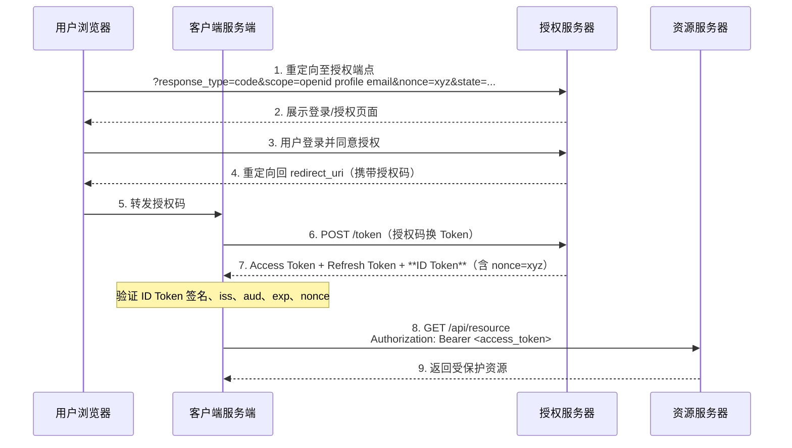
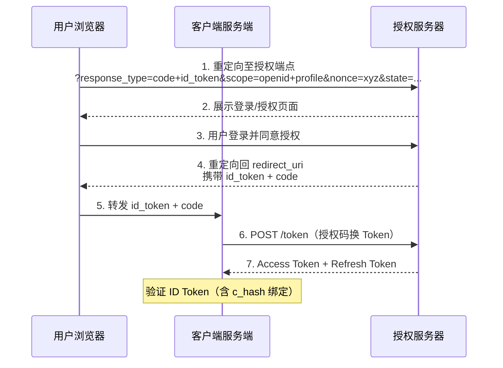

# OpenID Connect

OpenID Connect（OIDC）是构建在 OAuth2 之上的`身份认证层`。如果说 OAuth2 解决了"应用能做什么"，那么 OIDC 解决的是"用户是谁"。

**本文你会学到：**

- OIDC 与 OAuth2 的核心区别（授权 vs 认证）
- ID Token 的标准声明和验证步骤
- UserInfo 端点的使用场景
- OIDC 发现文档的作用
- OIDC 授权码流程与普通 OAuth2 授权码流程的差异
- Hybrid Flow 的三种 `response_type` 与适用场景
- OIDC 的会话管理与三种登出机制

## 🔗 OIDC 与 OAuth2 的关系

!!! info "关键区别"

    | 协议 | 解决的问题 | 核心令牌 |
    |------|----------|---------|
    | OAuth2 | `授权`：该应用有权限访问哪些资源？ | Access Token |
    | OpenID Connect | `认证`：当前登录的用户是谁？ | ID Token |

    OIDC 并不替代 OAuth2，而是在 OAuth2 授权码流程的基础上，额外颁发一个 `ID Token` 来携带用户身份信息。使用 OIDC 时，OAuth2 的所有机制都保持不变。

`OIDC 的三种流程：`

- `Authorization Code Flow`（最常用，推荐）
- Implicit Flow（已废弃）
- Hybrid Flow（部分场景使用）

## 🪪 ID Token

ID Token 就像一张**电子身份证**——它是 JWT 格式的令牌，里面包含已认证用户的身份信息（姓名、邮箱等）。和身份证一样，它有签发机构（`iss`）、有效期（`exp`）、持有人（`sub`），并且可以通过签名验证真伪。

ID Token 是 OIDC 的核心，是一个 `JWT 格式`的令牌（JWT 结构详见 [JWT 令牌](../jwt/index.md)），包含已认证用户的身份信息。

### 标准 Claim（声明）

| Claim | 含义 | 是否必须 |
|-------|------|---------|
| `sub` | 用户唯一标识符（Subject），在授权服务器范围内唯一 | ✅ 必须 |
| `iss` | ID Token 颁发者的 URL（Issuer） | ✅ 必须 |
| `aud` | 接收方，通常是客户端的 Client ID（可以是字符串或数组，多受众时为数组） | ✅ 必须 |
| `exp` | 过期时间（Unix 时间戳） | ✅ 必须 |
| `iat` | 颁发时间（Unix 时间戳） | ✅ 必须 |
| `nonce` | 客户端请求时传入的随机值，防重放攻击 | 若请求中有则必须 |
| `name` | 用户全名 | 可选（profile scope） |
| `email` | 用户邮箱 | 可选（email scope） |
| `picture` | 用户头像 URL | 可选（profile scope） |

`ID Token 示例（解码后的 Payload）：`

``` json
{
  "sub": "248289761001",
  "iss": "https://auth.example.com",
  "aud": "my-client-id",
  "exp": 1753123200,
  "iat": 1753119600,
  "nonce": "abc123",
  "name": "张三",
  "email": "zhangsan@example.com",
  "picture": "https://example.com/avatar.jpg"
}
```

### ID Token 验证步骤

客户端收到 ID Token 后`必须`验证：

1. 验证签名（使用授权服务器的公钥，通过 JWKS URI 获取）
2. 验证 `iss` 与预期授权服务器一致
3. 验证 `aud` 包含当前客户端的 Client ID
4. 验证 `exp` 未过期
5. 若请求时带了 `nonce`，验证 `nonce` 与请求值一致

## 👤 UserInfo 端点

ID Token 在登录时一次性颁发，里面的信息是登录那一刻的快照。如果用户后来改了邮箱呢？这时就需要 UserInfo 端点——它可以随时查询最新的用户信息。

UserInfo 端点是授权服务器提供的 API，客户端携带 Access Token 即可获取用户详细信息。

``` http
GET /userinfo
Authorization: Bearer <access_token>
```

响应示例：
``` json
{
  "sub": "248289761001",
  "name": "张三",
  "email": "zhangsan@example.com",
  "email_verified": true
}
```

!!! tip "ID Token vs UserInfo"

    - ID Token 在登录时一次性颁发，适合存储不经常变化的基础身份信息
    - UserInfo 端点可以随时查询最新用户信息，适合需要实时数据的场景

## 📋 OIDC 发现文档

还记得核心概念里讲的 JWKS 端点吗？发现文档就是它的升级版——不是一个端点的地址，而是`所有端点的地址集合`，外加服务器的能力声明。客户端访问一个固定的 URL 就能拿到全部配置，不用逐个硬编码。

支持 OIDC 的授权服务器必须在标准路径发布`发现文档（Discovery Document）`：

``` http
GET /.well-known/openid-configuration
```

发现文档包含授权服务器的所有端点地址和能力声明，客户端无需硬编码这些地址：

``` json
{
  "issuer": "https://auth.example.com",
  "authorization_endpoint": "https://auth.example.com/oauth2/authorize",
  "token_endpoint": "https://auth.example.com/oauth2/token",
  "userinfo_endpoint": "https://auth.example.com/userinfo",
  "jwks_uri": "https://auth.example.com/oauth2/jwks",
  "scopes_supported": ["openid", "profile", "email"],
  "response_types_supported": ["code"],
  "subject_types_supported": ["public"],
  "id_token_signing_alg_values_supported": ["RS256", "ES256"]
}
```

## 🔄 OIDC 授权码流程（与 OAuth2 的差异）

如果你已经理解了 OAuth2 的授权码流程，那么 OIDC 版本只是在三个地方做了扩展——

1. **请求中必须包含 `openid` scope**：这是触发 OIDC 模式的关键
2. **Token 端点额外返回 `id_token`**
3. **可选 `nonce` 参数**：防止 ID Token 重放攻击



`执行过程说明：`

1. `发起 OIDC 授权请求`：与普通 OAuth2 授权码流程的关键区别在于 `scope` 参数**必须包含 `openid`**，这是告知授权服务器启用 OIDC 模式的信号。可额外附加 `profile`、`email` 等 scope 来请求用户资料信息。`nonce` 是客户端生成的随机值，用于防止 ID Token 重放攻击。
2. `展示授权页面`：授权服务器展示登录/同意页面，用户认证过程完全在授权服务器侧进行。
3. `用户完成认证授权`：用户登录并同意授权。由于 `openid` scope 的存在，授权服务器知道此次需要返回身份信息。
4. `颁发授权码`：与标准 OAuth2 流程相同，返回一次性短效授权码。
5. `转发授权码`：浏览器访问回调地址，客户端服务端取出授权码，并验证 `state` 防 CSRF。
6. `凭码换 Token`：客户端服务端在后端向 Token 端点发起请求，流程与 OAuth2 相同。
7. `额外颁发 ID Token`：OIDC 的核心差异在于 Token 端点`除了返回 Access Token 和 Refresh Token，还额外返回 ID Token`。ID Token 是一个 JWT，内嵌用户身份信息（`sub`、`email`、`name` 等）和安全验证字段（`iss`、`aud`、`exp`、`nonce`）。客户端服务端`必须`完整验证 ID Token（见[ID Token 验证步骤](#id-token-验证步骤)），确认其来自可信授权服务器且是对本次请求的响应（nonce 一致性检验防重放）。
8. `携带 Access Token 访问受保护 API`：获取用户身份后，客户端可用 Access Token 正常访问资源服务器。ID Token 用于`认证`（知道用户是谁），Access Token 用于`授权`（访问受保护的资源）。
9. `返回资源`：资源服务器验证 Access Token 后返回数据。

## 🏷️ 标准 Scope 对应的 Claim

| Scope | 包含的 Claim |
|-------|------------|
| `openid` | `sub`（必须包含此 scope 才触发 OIDC） |
| `profile` | `name`、`given_name`、`family_name`、`picture`、`locale` 等 |
| `email` | `email`、`email_verified` |
| `address` | `address`（结构化地址对象） |
| `phone` | `phone_number`、`phone_number_verified` |

## Hybrid Flow

前面介绍了 Authorization Code Flow 和 Implicit Flow。OIDC 还定义了 Hybrid Flow——它结合两者的优势：Token 通过后端通道（Token 端点）获取（更安全），ID Token 在前端通道返回（减少一次往返）。就像既使用了快递代取（安全性）又附带了短信通知（即时性）。

### response_type 与流程类型

| `response_type` 值 | 流程类型 |
|---------------------|---------|
| `code` | Authorization Code Flow |
| `id_token` | Implicit Flow |
| `id_token token` | Implicit Flow |
| `code id_token` | Hybrid Flow |
| `code token` | Hybrid Flow |
| `code id_token token` | Hybrid Flow |

### 三种流程对比

| 属性 | Authorization Code | Implicit | Hybrid |
|------|-------------------|---------|--------|
| 所有令牌从 Token 端点返回 | 是 | 否 | 否 |
| 令牌不经过 User Agent | 是 | 否 | 是 |
| 客户端可被认证 | 是 | 否 | 是 |
| 支持 Refresh Token | 是 | 否 | 是 |
| 单次往返完成 | 否 | 是 | 否 |

### Hybrid Flow 执行过程

以 `response_type=code id_token` 为例：



`执行过程说明：`

1. `发起 Hybrid 授权请求`：`response_type` 使用 `code id_token`，告知授权服务器同时返回 ID Token 和 Authorization Code。必须包含 `nonce` 参数。
2. `展示授权页面`：与 Authorization Code Flow 相同。
3. `用户完成认证授权`：用户登录并同意。
4. `同时返回 ID Token 和 Code`：与 Authorization Code Flow 不同，授权端点在重定向响应中直接返回 ID Token（URL Fragment 或 Query 中），同时返回 Authorization Code。`注意：Access Token 不会在前端通道返回，必须通过 Token 端点获取。`
5. `转发到客户端服务端`：客户端提取 ID Token 和 Authorization Code，进行后续处理。
6. `凭码换 Token`：与标准授权码流程相同，客户端服务端用 Authorization Code 向 Token 端点换取 Access Token 和 Refresh Token。
7. `验证 ID Token 中的 c_hash`：由于 Authorization Code 经过了浏览器，客户端需要验证 ID Token 中的 `c_hash` 声明，确认返回的 Code 确实由授权服务器颁发给这个 ID Token 的。

### ID Token 的 c_hash 和 at_hash 声明

Hybrid Flow 中 ID Token 必须包含以下声明，以绑定 Authorization Code 和 Access Token：

- `c_hash`：Authorization Code 的 SHA-256 哈希值的前半部分（base64url 编码）
- `at_hash`（如果 Access Token 同时在授权响应中返回）：Access Token 的 SHA-256 哈希值的前半部分

> `c_hash` 和 `at_hash` 是 Hybrid Flow 的核心安全机制。它们确保 ID Token 中返回的 code 和 token 是合法颁发给这个 ID Token 的，防止令牌替换攻击。

!!! tip "为什么 Hybrid Flow 需要 c_hash？"

    在 Hybrid Flow 中，Authorization Code 经过了用户浏览器（前端通道），存在被篡改的风险。`c_hash` 将 ID Token（由授权服务器签名，无法伪造）与 Authorization Code 绑定在一起，客户端可以验证收到的 Code 确实是授权服务器颁发的，而不是攻击者替换的。

## 会话管理（Session Management）

OIDC 提供了标准的会话管理机制，允许客户端（RP）实时感知用户在 OP（OpenID Provider）端的登录状态。

### OP Session 状态检查

授权服务器的发现文档中包含 `check_session_iframe` 字段，指向一个可嵌入的 iframe 页面。客户端通过以下方式轮询 OP 的会话状态：

1. 在页面中嵌入 OP 的 `check_session_iframe`
2. 向 iframe 发送 `postMessage`，包含 `client_id` 和当前页面的 `session_state`
3. OP 返回用户的登录状态（已登录 / 已登出）

`session_state` 参数由 OP 在授权响应中返回，客户端需要存储它以用于后续的状态检查。

!!! example "OP 发现文档中的会话管理相关字段"

    ``` json
    {
      "check_session_iframe": "https://auth.example.com/session/iframe",
      "end_session_endpoint": "https://auth.example.com/session/end"
    }
    ```

整个检查过程通过浏览器端的 `postMessage` API 完成，实现简洁，适合需要实时感知用户登出状态的 SPA 应用。

## 登出机制

OIDC 定义了三种互补的登出机制，分别解决不同的场景。

### RP-Initiated Logout

用户在 RP 端主动发起登出。RP 将用户浏览器重定向到 OP 的 `end_session_endpoint`：

``` http
GET /end_session?
  id_token_hint=eyJhbGciOiJSUzI1NiIs...
  &post_logout_redirect_uri=https%3A%2F%2Frp.example.com
  &state=af0ifjsldkj
```

| 参数 | 说明 |
|------|------|
| `id_token_hint` | 可选。之前颁发的 ID Token，帮助 OP 识别用户会话 |
| `post_logout_redirect_uri` | 可选。登出后重定向的 URL，必须预先注册 |
| `state` | 可选。用于维护请求/响应的关联，防止 CSRF |

OP 展示确认页面后执行登出，然后重定向回 RP。

### Front-Channel Logout

OP 通过 iframe 通知 RP 登出。OP 将 RP 的 `frontchannel_logout_uri` 嵌入 iframe 中加载，RP 收到请求后清除本地会话。

**优点**：实现简单，无需 RP 提供额外的服务端端点。
**缺点**：依赖浏览器 iframe 加载，可能被浏览器策略阻止；不可靠（iframe 可能不执行）。

### Back-Channel Logout

OP 通过服务端直接通知 RP 登出。OP 向 RP 的 `backchannel_logout_uri` 发送 HTTP POST 请求，携带一个 Logout Token：

``` http
POST /backchannel_logout HTTP/1.1
Content-Type: application/x-www-form-urlencoded

logout_token=eyJraGQiOi...
```

Logout Token 是一个签名的 JWT，包含以下声明：

| Claim | 说明 |
|-------|------|
| `iss` | OP 的 Issuer URL |
| `sub` | 登出用户的主键标识 |
| `aud` | RP 的 Client ID |
| `iat` | Logout Token 的颁发时间 |
| `jti` | JWT ID，唯一标识此 Token |
| `sid` | Session ID，标识被终止的会话 |
| `events` | 必须包含 `http://schemas.openid.net/event/backchannel-logout` |

**优点**：可靠，直接服务端通信，不依赖浏览器。
**缺点**：实现复杂，RP 需要提供 HTTPS 端点并验证 Logout Token 签名。

### 三种 Logout 对比

| 维度 | RP-Initiated | Front-Channel | Back-Channel |
|------|-------------|---------------|--------------|
| 触发方 | RP（用户主动） | OP | OP |
| 通知方式 | 浏览器重定向 | iframe 加载 | 服务端 HTTP POST |
| 可靠性 | 中（依赖用户确认） | 低（iframe 可能被阻止） | 高（直接通信） |
| 实现复杂度 | 低 | 中 | 高 |
| 适用场景 | 用户主动登出 | 简单场景 | 高安全要求场景 |

!!! tip "生产环境建议"

    高安全要求的系统应优先实现 Back-Channel Logout，确保 OP 端登出后能可靠地通知所有 RP 清除本地会话。Front-Channel Logout 适合作为补充手段。

---

`上一篇：` [端点与发现](../endpoints/index.md)
`下一篇：` [扩展协议](../extensions/index.md)
