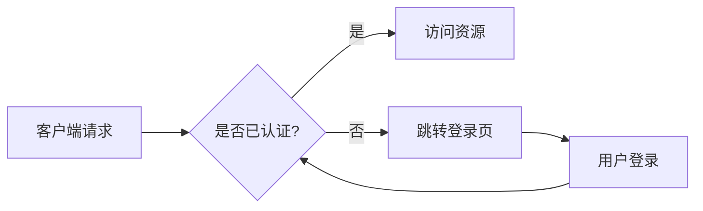
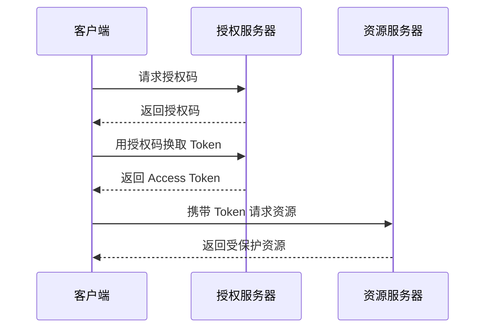
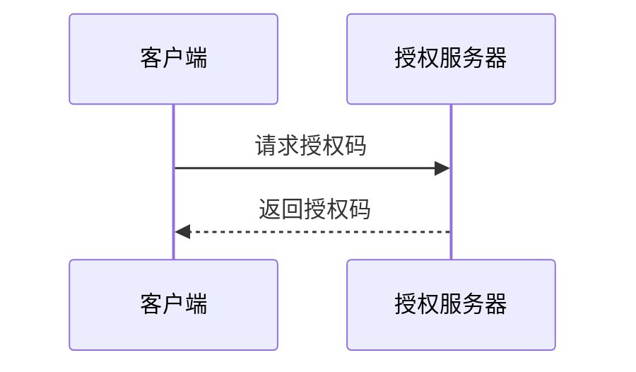
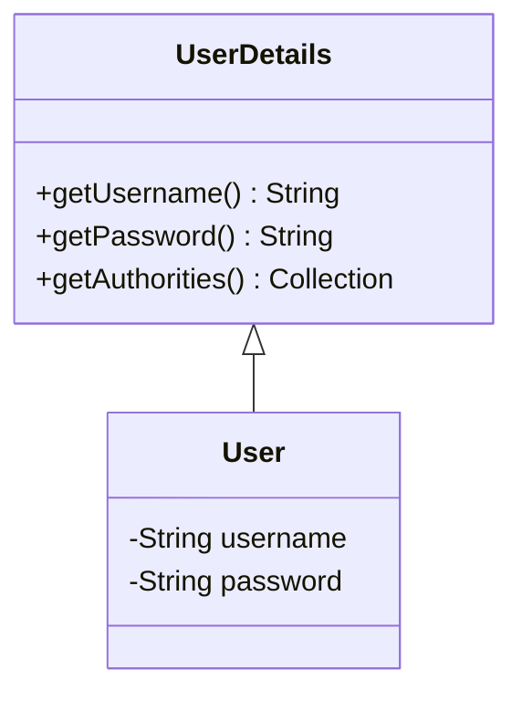

# 基本markdown内容

## 警示框

### 自定义标题

!!! note "Phasellus posuere in sem ut cursus"

    Lorem ipsum dolor sit amet, consectetur adipiscing elit. Nulla et euismod
    nulla. Curabitur feugiat, tortor non consequat finibus, justo purus auctor
    massa, nec semper lorem quam in massa.

```markdown
!!! note "Phasellus posuere in sem ut cursus"

    Lorem ipsum dolor sit amet, consectetur adipiscing elit. Nulla et euismod
    nulla. Curabitur feugiat, tortor non consequat finibus, justo purus auctor
    massa, nec semper lorem quam in massa.
```

### 嵌套

!!! note "Outer Note"

    Lorem ipsum dolor sit amet, consectetur adipiscing elit. Nulla et euismod
    nulla. Curabitur feugiat, tortor non consequat finibus, justo purus auctor
    massa, nec semper lorem quam in massa.

    !!! note "Inner Note"

        Lorem ipsum dolor sit amet, consectetur adipiscing elit. Nulla et euismod
        nulla. Curabitur feugiat, tortor non consequat finibus, justo purus auctor
        massa, nec semper lorem quam in massa.

```markdown
!!! note "Outer Note"

    Lorem ipsum dolor sit amet, consectetur adipiscing elit. Nulla et euismod
    nulla. Curabitur feugiat, tortor non consequat finibus, justo purus auctor
    massa, nec semper lorem quam in massa.

    !!! note "Inner Note"

        Lorem ipsum dolor sit amet, consectetur adipiscing elit. Nulla et euismod
        nulla. Curabitur feugiat, tortor non consequat finibus, justo purus auctor
        massa, nec semper lorem quam in massa.
```

### 移除标题

!!! note ""

    Lorem ipsum dolor sit amet, consectetur adipiscing elit. Nulla et euismod
    nulla. Curabitur feugiat, tortor non consequat finibus, justo purus auctor
    massa, nec semper lorem quam in massa.

```markdown
!!! note ""

    Lorem ipsum dolor sit amet, consectetur adipiscing elit. Nulla et euismod
    nulla. Curabitur feugiat, tortor non consequat finibus, justo purus auctor
    massa, nec semper lorem quam in massa.
```

### 折叠块

??? note

    Lorem ipsum dolor sit amet, consectetur adipiscing elit. Nulla et euismod
    nulla. Curabitur feugiat, tortor non consequat finibus, justo purus auctor
    massa, nec semper lorem quam in massa.

```markdown
??? note

    Lorem ipsum dolor sit amet, consectetur adipiscing elit. Nulla et euismod
    nulla. Curabitur feugiat, tortor non consequat finibus, justo purus auctor
    massa, nec semper lorem quam in massa.
```

在 ??? 标记后添加一个 + 号，可以使该区块默认展开：

???+ note

    Lorem ipsum dolor sit amet, consectetur adipiscing elit. Nulla et euismod
    nulla. Curabitur feugiat, tortor non consequat finibus, justo purus auctor
    massa, nec semper lorem quam in massa.

```markdown
???+ note

    Lorem ipsum dolor sit amet, consectetur adipiscing elit. Nulla et euismod
    nulla. Curabitur feugiat, tortor non consequat finibus, justo purus auctor
    massa, nec semper lorem quam in massa.
```
### 内联块

可以作为内联块显示（例如用于侧边栏），通过 inline + end 修饰符将其放置在右侧，或者仅使用 inline 修饰符将其放置在左侧：

!!! info inline end "Lorem ipsum"

    Lorem ipsum dolor sit amet, consectetur
    adipiscing elit. Nulla et euismod nulla.
    Curabitur feugiat, tortor non consequat
    finibus, justo purus auctor massa, nec
    semper lorem quam in massa.

```markdown
!!! info inline end "Lorem ipsum"

    Lorem ipsum dolor sit amet, consectetur
    adipiscing elit. Nulla et euismod nulla.
    Curabitur feugiat, tortor non consequat
    finibus, justo purus auctor massa, nec
    semper lorem quam in massa.
```

!!! info inline "Lorem ipsum"

    Lorem ipsum dolor sit amet, consectetur
    adipiscing elit. Nulla et euismod nulla.
    Curabitur feugiat, tortor non consequat
    finibus, justo purus auctor massa, nec
    semper lorem quam in massa.

```markdown
!!! info inline "Lorem ipsum"

    Lorem ipsum dolor sit amet, consectetur
    adipiscing elit. Nulla et euismod nulla.
    Curabitur feugiat, tortor non consequat
    finibus, justo purus auctor massa, nec
    semper lorem quam in massa.
```

<br>
<br>
<br>

!!! important "重要提示"

	使用内联修饰符的警告框必须在你希望其并排显示的内容块之前声明。如果旁边空间不足以显示警告框，警告框会自动扩展至视口的整个宽度，例如在移动端视口下。

### 支持的类型

`note`
:   !!! note

        这是一段用于排版的占位符文本，旨在展示页面的字体和布局效果。

`abstract`
:   !!! abstract

        这是一段用于排版的占位符文本，旨在展示页面的字体和布局效果。

`info`
:   !!! info

        这是一段用于排版的占位符文本，旨在展示页面的字体和布局效果。

`tip`
:   !!! tip

        这是一段用于排版的占位符文本，旨在展示页面的字体和布局效果。

`success`
:   !!! success

        这是一段用于排版的占位符文本，旨在展示页面的字体和布局效果。

`question`
:   !!! question

        这是一段用于排版的占位符文本，旨在展示页面的字体和布局效果。

`warning`
:   !!! warning

        这是一段用于排版的占位符文本，旨在展示页面的字体和布局效果。

`failure`
:   !!! failure

        这是一段用于排版的占位符文本，旨在展示页面的字体和布局效果。

`danger`
:   !!! danger

        这是一段用于排版的占位符文本，旨在展示页面的字体和布局效果。

`bug`
:   !!! bug

        这是一段用于排版的占位符文本，旨在展示页面的字体和布局效果。

`example`
:   !!! example

        这是一段用于排版的占位符文本，旨在展示页面的字体和布局效果。

`quote`
:   !!! quote

        这是一段用于排版的占位符文本，旨在展示页面的字体和布局效果。

---

## 内容选项卡

将同类型但不同变体的内容组织在可切换的选项卡中，常用于多语言代码示例。

=== "Java"

    ```java
    public class Hello {
        public static void main(String[] args) {
            System.out.println("Hello, World!");
        }
    }
    ```

=== "Python"

    ```python
    print("Hello, World!")
    ```

=== "JavaScript"

    ```javascript
    console.log("Hello, World!");
    ```

```markdown
=== "Java"

    ```java
    public class Hello {
        public static void main(String[] args) {
            System.out.println("Hello, World!");
        }
    }
    ```

=== "Python"

    ```python
    print("Hello, World!")
    ```
```

选项卡内可包含任意 Markdown 内容，不仅限于代码块：

=== "无序列表"

    - Spring Boot
    - Spring Security
    - Spring Cloud

=== "有序列表"

    1. 安装依赖
    2. 编写配置
    3. 启动应用

```markdown
=== "无序列表"

    - Spring Boot
    - Spring Security
    - Spring Cloud

=== "有序列表"

    1. 安装依赖
    2. 编写配置
    3. 启动应用
```

---

## 代码块增强

### 标题与行号

````markdown
```python title="hello.py" linenums="1"
def greet(name: str) -> str:
    return f"Hello, {name}!"

print(greet("World"))
```
````

```python title="hello.py" linenums="1"
def greet(name: str) -> str:
    return f"Hello, {name}!"

print(greet("World"))
```

### 高亮指定行

````markdown
``` java hl_lines="3 4"
public class Example {
    public static void main(String[] args) {
        String msg = "这两行被高亮";
        System.out.println(msg);
    }
}
```
````

``` java hl_lines="3 4"
public class Example {
    public static void main(String[] args) {
        String msg = "这两行被高亮";
        System.out.println(msg);
    }
}
```

### 代码注解

在代码中写 `# (1)!`，然后在代码块外按编号补充说明：

````markdown
``` yaml
server:
  port: 8080 # (1)!
spring:
  datasource:
    url: jdbc:mysql://localhost:3306/demo # (2)!
```

1. 应用端口，默认 8080
2. 数据库连接地址，根据实际环境修改
````

``` yaml
server:
  port: 8080 # (1)!
spring:
  datasource:
    url: jdbc:mysql://localhost:3306/demo # (2)!
```

1. 应用端口，默认 8080
2. 数据库连接地址，根据实际环境修改

### 行内语法高亮

在行内代码中使用 `#!语言` 前缀实现高亮：

```markdown
调用 `#!python range(10)` 会生成 0 到 9 的整数序列。
Spring 注解 `#!java @RestController` 用于声明 REST 控制器。
```

调用 `#!python range(10)` 会生成 0 到 9 的整数序列。
Spring 注解 `#!java @RestController` 用于声明 REST 控制器。

### 复制与选择按钮

````markdown
``` { .yaml .copy }
# 此代码块强制显示复制按钮
key: value
```

``` { .yaml .no-copy }
# 此代码块隐藏复制按钮（密码等敏感信息）
password: secret
```
````

---

## 文本格式化扩展

| 效果 | 语法 | 示例 |
| ---- | ---- | ---- |
| ==高亮== | `==文本==` | 这是 ==高亮内容== |
| ^^下划线^^ | `^^文本^^` | 这是 ^^下划线内容^^ |
| ~~删除线~~ | `~~文本~~` | 这是 ~~删除的内容~~ |
| H~2~O 下标 | `H~2~O` | 水的化学式：H~2~O |
| E=mc^2^ 上标 | `mc^2^` | 质能方程：E=mc^2^ |
| ++键位++ | `++ctrl+s++` | 保存快捷键：++ctrl+s++ |

```markdown
这是 ==高亮内容==
这是 ^^下划线内容^^
这是 ~~删除的内容~~
水的化学式：H~2~O
质能方程：E=mc^2^
保存快捷键：++ctrl+s++
```

---

## 图标与 Emoji

使用短码（shortcode）插入图标，各图标集用 `-` 分隔命名空间：

:smile: :heart: :thumbsup:

:fontawesome-brands-github: :fontawesome-brands-java: :fontawesome-solid-code:

:lucide-check: :lucide-x: :lucide-info:

:material-github: :material-language-java: :material-react:

```markdown
:smile:
:fontawesome-brands-github:
:lucide-check:
:material-language-java:
```

为图标添加 tooltip 或自定义样式：

```markdown
:material-information-outline:{ title="这是一条重要说明" }
:fontawesome-brands-youtube:{ .youtube }
```

---

## 图片增强

### 带图注（项目统一格式）

<figure markdown="span">
  { loading=lazy }
  <figcaption>图 3.3 授权服务器的审批页面，用于处理我们客户端的请求</figcaption>
</figure>

```markdown
<figure markdown="span">
  { loading=lazy }
  <figcaption>图 X.X 图注说明文字</figcaption>
</figure>
```

### 对齐

```markdown
{ align=left width="80" }
左对齐图片，文字会在图片右侧环绕。
```

### 深色/浅色模式不同图片

```markdown


```

### 懒加载（无图注的简单图片）

```markdown
{ loading=lazy }
```

---

## 网格布局

使用 `grid cards` 创建卡片式布局，适合首页或模块索引：

<div class="grid cards" markdown>

- :fontawesome-brands-java: **Java 基础**

    面向对象、集合框架、并发编程

- :fontawesome-brands-react: **React**

    组件化开发、Hooks、状态管理

- :lucide-shield: **Spring Security**

    认证、授权、OAuth2

- :lucide-database: **数据库**

    MySQL、Redis、JPA

</div>

```markdown
<div class="grid cards" markdown>

- :fontawesome-brands-java: **Java 基础**

    面向对象、集合框架、并发编程

- :fontawesome-brands-react: **React**

    组件化开发、Hooks、状态管理

</div>
```

---

## 脚注

在正文中引用脚注[^1]，脚注内容会自动渲染到页面底部[^详细说明]。

[^1]: 这是一条简短的脚注。

[^详细说明]:
    这是一条多行脚注。

    可以包含多段内容，使用 4 个空格缩进续行。

```markdown
正文中的脚注引用[^1]。

[^1]: 脚注内容（单行）。

[^2]:
    多行脚注第一段。

    第二段继续缩进 4 空格。
```

---

## 定义列表

适合用于术语解释或 API 参数说明：

`Spring Boot`
:   一个用于快速构建 Spring 应用的框架，内嵌 Tomcat，无需部署 WAR 包。

`Spring Security`
:   为 Spring 应用提供认证（Authentication）和授权（Authorization）的安全框架。

`OAuth2`
:   开放授权协议，允许第三方应用在用户授权下访问其资源，而无需获取密码。

```markdown
`Spring Boot`
:   一个用于快速构建 Spring 应用的框架。

`Spring Security`
:   为 Spring 应用提供认证和授权的安全框架。
```

---

## 任务列表

- [x] 安装 Python 环境
- [x] 安装 zensical：`pip install zensical`
- [x] 运行本地预览：`zensical serve`
- [ ] 编写文档内容
- [ ] 配置导航（zensical.toml）
- [ ] 部署到 GitHub Pages

```markdown
- [x] 已完成的任务
- [ ] 待完成的任务
    * 子任务支持嵌套
```

---

## Mermaid 图表

### 流程图



````markdown

````

### 时序图



````markdown

````

### 类图



---

## 缩略词（Abbreviations）

定义缩略词后，页面中所有匹配的词汇会自动添加 tooltip 说明：

在本页中，JWT 是常见的认证令牌格式，HTML 是超文本标记语言。

*[JWT]: JSON Web Token
*[HTML]: HyperText Markup Language

```markdown
JWT 是常见的认证令牌格式，HTML 是超文本标记语言。

*[JWT]: JSON Web Token
*[HTML]: HyperText Markup Language
```

---

## Front Matter

在文件顶部使用 YAML front matter 配置页面元数据：

```markdown
---
title: 自定义页面标题（覆盖 H1 标题）
description: 用于 SEO 的页面描述
icon: lucide/book-open
status: new
hide:
  - navigation
  - toc
---

# 页面内容...
```

**`status` 可用值**（需在 `zensical.toml` 的 `extra.status` 中定义）：

| 值 | 含义 |
| -- | ---- |
| `new` | 新增内容 |
| `deprecated` | 已废弃 |

**`icon` 图标短码**：使用 `lucide/名称`、`fontawesome/brands/名称` 等格式。

**`hide` 可隐藏的元素**：`navigation`（左侧导航栏）、`toc`（右侧目录）。

---

## 按钮

将链接渲染为按钮样式，常用于页面底部的 CTA（行动号召）：

[快速开始](#){ .md-button }
[立即下载](#){ .md-button .md-button--primary }
[查看源码 :fontawesome-brands-github:](#){ .md-button }

```markdown
[快速开始](#){ .md-button }
[立即下载](#){ .md-button .md-button--primary }
[查看源码 :fontawesome-brands-github:](#){ .md-button }
```

---

## Tooltips（悬停提示）

为链接、图标添加悬停提示文字：

[悬停查看提示](https://spring.io "Spring 官网，提供完整的文档和教程")

:material-information-outline:{ title="注意：此配置项在 0.0.25 版本中已更改行为" }

```markdown
[悬停查看提示](https://spring.io "Spring 官网")

:material-information-outline:{ title="注意：此处有重要说明" }
```

---

## 页面间链接

!!! tip "推荐使用相对路径链接到 Markdown 文件"

    Zensical 会自动将 Markdown 文件链接转换为正确的 HTML 链接。

```markdown
<!-- 推荐：链接到 .md 文件 -->
参考 [数学公式](../math/index.md) 章节。

<!-- 不推荐：直接链接到 HTML（部署路径变更后会失效） -->
参考 [数学公式](../math/) 章节。
```
